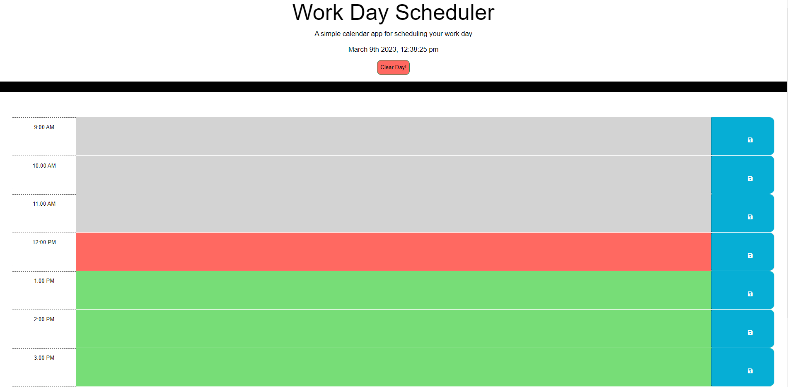
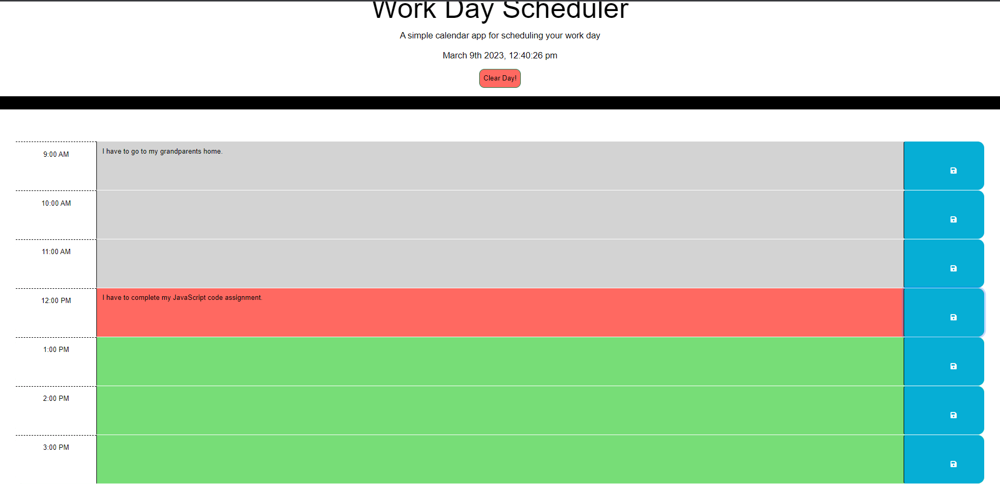
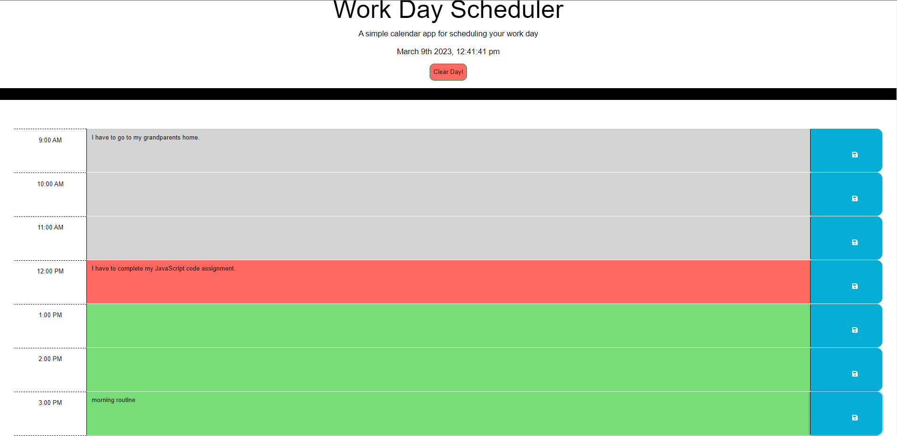

# Third-party apis challenge work day scheduler

# Description:

This third-party apis challenge work day scheduler is a web application that uses jquery, bootstrap, and moment.js that will help  you to eschedule your work day. 

# Usage:

Simply click on the textarea of the timeblock you want to change and type in your schedule for the hour. When you are done, click the save icon and it will be saved in local storage for later use.

# Technology Used:

* HTML
* CSS
* JavaScript
* Bootstrap
* jQuery
* moment.js

# Installation

first of all you need to have Node invironment in your local machine to run javascript file

step 1 : clone my repository to your local machine

step 2 :  open in terminal if you are in mac or linux operating system or in command prompt if you are in window

step 3 : type this command  ( cd crispy-octo-meme  ) to navigate to the project

step 4 : type this command ( code .) this helps to open in VS code

step 5 : when you are in VS code click the terminal tab from the VS code to open a terminal from VS code

step 6 : then type git status or git branch and make sure you are on the main branch

step 7 : finally go to the index.html run it . just open it using live server and see the result

step 8 : you can get html.index file when you open Develop folder

step 9 : simply click on the textarea of the timeblock you want to change and type in your schedule for the hour. When you are done, click the save icon and it will be saved in local storage for later use.

that's it !

# Screenshots!

**Done!  congratulations**

# License

you can clone and use this code for your own task

Access application here :

---
